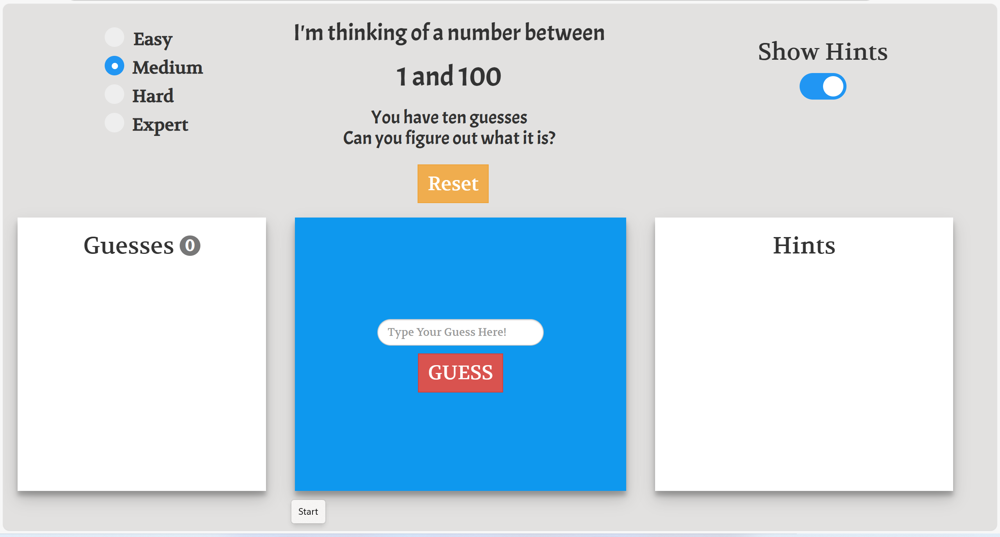
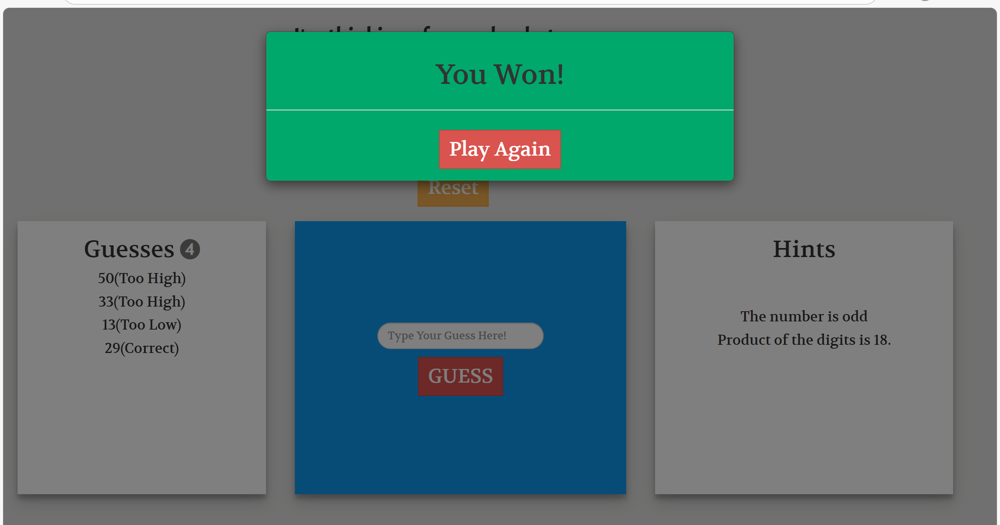

# 🎯 Guess The Number – Web Game

An engaging, **browser-based number guessing game** built using **HTML, CSS (Bootstrap), JavaScript, and jQuery**, featuring:

- ✅ **Four Difficulty Levels (Easy → Expert)** 🎮  
- ✅ **Smart Hints System** 💡  
- ✅ **Reset and Replay Anytime** 🔄  
- ✅ **Responsive and Mobile-Friendly Design** 📱  

---

## 🚀 Features

- Choose from **4 difficulty levels**:
  - Easy → Range **1–10**  
  - Medium → Range **1–100**  
  - Hard → Range **1–1000**  
  - Expert → Range **1–10000**
- **Hints to help you guess:**
  - Even or odd number  
  - Product of digits  
  - Divisibility clues (by **3 or 5**)  
  - A random digit from the number  
- **10 attempts** to guess the secret number.  
- Toggle **Show/Hide Hints** anytime.  
- Fully **responsive** for desktop and mobile browsers.  

---

## 📂 Project Structure

```
Guess_The_Number_Game/
│── index.html         # Main webpage
│── index.js           # Game logic
│── bootstrap.js       # Bootstrap library
│── bootstrap.min.js   # Minified Bootstrap version
│── npm.js             # Bootstrap dependency loader
│── fonts/             # Icon font files
│── css/               # Stylesheets
│── README.md          # Project documentation
│── LICENSE            # MIT License file
│── images/            # Screenshots for demo
```

---

## 🛠️ Technologies Used

- **HTML5** – Game structure and content  
- **CSS3 + Bootstrap** – Styling, layout, and responsiveness  
- **JavaScript (jQuery)** – Game logic, random number generation, and event handling  

---

## 📷 Screenshots

| Game Start Screen                         | Game in Progress with Hints                  |
|--------------------------------------------|-----------------------------------------------|
|  |  |


---

## ⚡ How to Run the Project

1. Download or clone this repository:
   ```bash
   git clone https://github.com/your-username/Guess-The-Number.git
   ```
2. Open **index.html** in any modern browser.  
3. Select your difficulty and start guessing! 🎮

---

## 🌟 Future Enhancements

- 🎵 Add **sound effects** for guesses (correct/wrong).  
- 🏆 Introduce **leaderboards** to track high scores.  
- 🌙 Add **dark mode theme** for better accessibility.  
- 🌐 Deploy live on **GitHub Pages** for instant play.  

---

## 👩‍💻 Author

**Madhumitha Mohankumar**  
💼 Software Development Intern – SkillCraft Technology  
📌 Project built using HTML, CSS (Bootstrap), and JavaScript  

---

## 📜 License

This project is licensed under the [MIT License](LICENSE) – you are free to use, modify, and distribute this software with proper credit.
